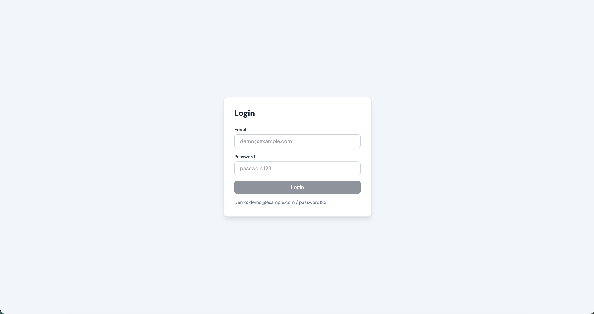
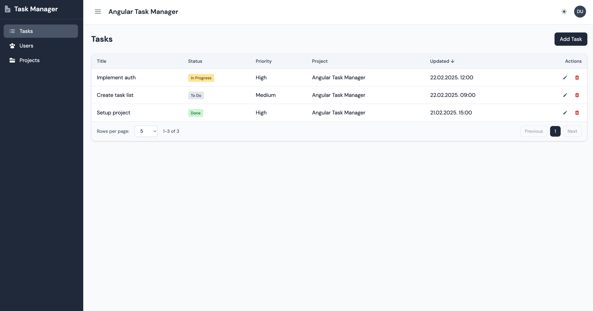
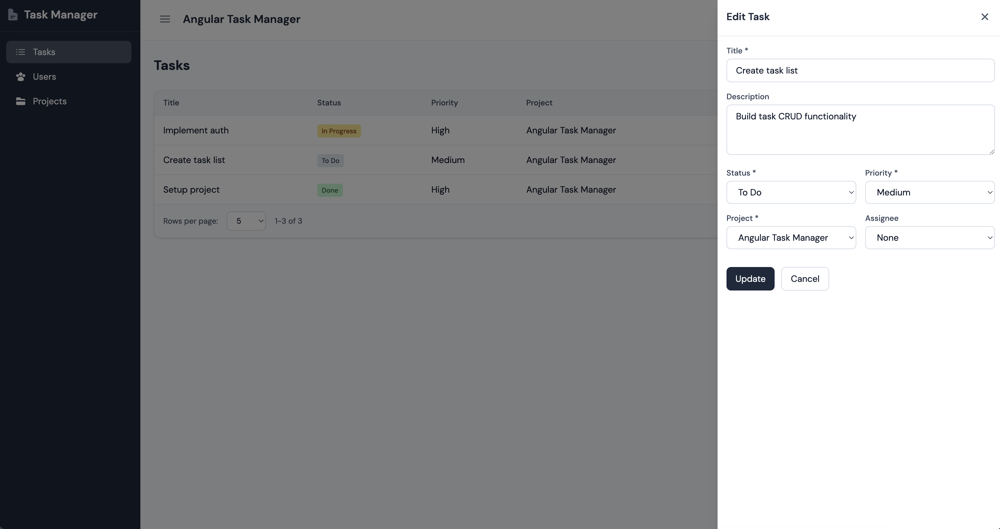

# Angular Task Manager

An application for managing tasks, users, and projects. Demo project built with Angular 18 using standalone components, mock authentication, and full CRUD functionality.

## What is this app

- **Auth (mock)** – Login/Logout with a hardcoded user (`demo@example.com / password123`)
- **CRUD** – Tasks, users, and projects with create, edit, and delete
- **UI** – Tailwind CSS, responsive layout, sidebar + topbar

## Tech stack

- Angular 18
- TypeScript
- Tailwind CSS
- Angular Router
- Reactive Forms
- Mock API (in-memory)

## How to run

```bash
# Install dependencies
npm install

# Development server
npm start
# App: http://localhost:4200

# Build
npm run build

# Unit tests
npm test

# E2E tests (Playwright)
npm run e2e
```

## Login credentials

- **Email:** demo@example.com
- **Password:** password123

## Screenshots

1. **Login – Login screen**

   

2. **Tasks – Task list with CRUD actions**

   

3. **Drawer – Sidebar + drawer with form**

   

*(Screenshots: run `npm start`, open http://localhost:4200, log in and take the screenshots)*

## Why this app was created

This project was created as a demonstration of Angular 18 best practices: standalone components, services, guards, pipes, reactive forms, environment config, and a clean project structure (core/features/shared). No backend and no overengineering.
